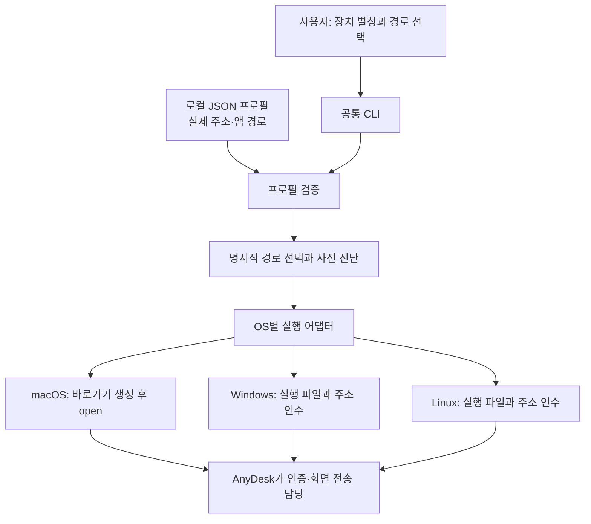
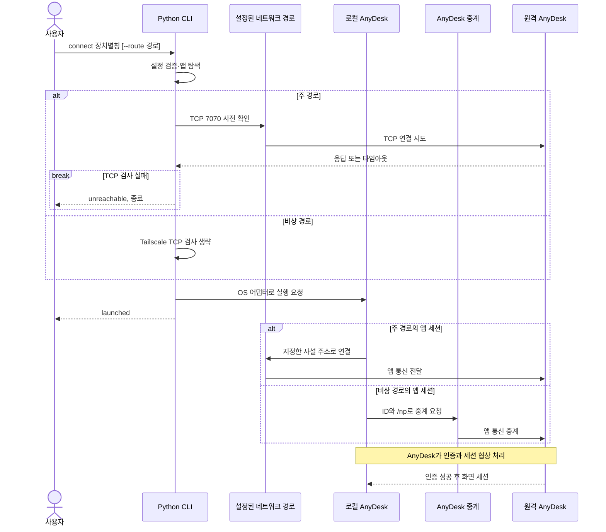
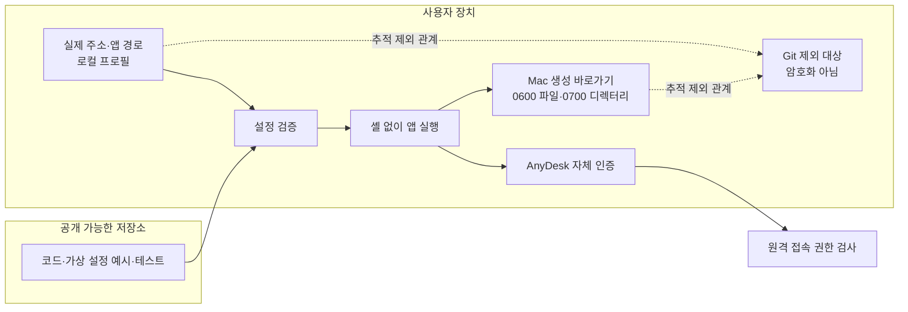

# 현장 승인 없이 시작한 원격 접속: Mac 실행기에서 장치 프로필 기반 CLI까지

집에서 학원 PC의 화면을 조작해야 했다. 원격 접속 프로그램은 양쪽에 설치되어 있었지만, 연결을 승인할 사람은 학원에 없었다. 이 프로젝트는 그 상황에서 출발해, 실제 접속을 확보한 **v1의 Mac 전용 실행기**와 반복 사용의 제약을 해결한 **v2의 공통 CLI**로 발전했다.

핵심은 새로운 화면 전송 기술을 만드는 일이 아니었다. 네트워크 연결, 인증, 앱 실행을 구분해 문제를 진단하고, 이미 설치된 도구를 사용할 수 있는 경로를 찾은 다음 그 절차를 재사용 가능한 애플리케이션으로 정리하는 일이었다.

용어와 주장 범위가 모호하게 느껴진다면 [개념과 표현 해설](CONCEPTS.md)을 함께 참고할 수 있다.

## 프로젝트 개요

| 구분 | 내용 |
| --- | --- |
| 해결하려던 문제 | 현장 승인 없이 원격 PC의 GUI에 접속하고, 반복 접속 절차를 간소화 |
| 실제 사용 환경 | 집의 Apple Silicon Mac → 학원의 Windows PC |
| 사용 기술 | Python 표준 라이브러리, zsh, Tailscale, AnyDesk, 기존 SSH 관리 인증 |
| v1 | `main` · `v1.0.0` · `3fb3a2f`: Mac용 실행기 |
| v2 | `feature/portable-access-v2` · `v2.0.0` · `5881a38`: 장치 프로필과 OS 어댑터 기반 CLI |
| 확인한 결과 | 현장 승인 없는 GUI 접속, Mac에서 공통 CLI 진단·실행, 자동 테스트 14개 통과 |
| 검증의 경계 | Windows/Linux는 명령 생성 모의 검증. 실제 장애 복구·재부팅 시험은 미수행 |

두 버전은 별개의 문제 해결 사례가 아니라 같은 문제의 발전 단계다. v1은 당장 사용할 수 있는 연결을 제공하고, v2는 접속 대상과 실행 환경이 달라질 때 코드를 수정해야 하는 범위를 줄였다. Git의 v1 기준 커밋은 당시 보존된 파일로 나중에 만든 스냅샷이며, 모든 시행착오를 시간순으로 기록한 개발 이력은 아니다.

## 1. 프로그램은 설치되어 있었지만 연결할 수 없었다

사용자가 원한 것은 파일 전송이나 명령 실행만이 아니었다. 학원 PC의 기존 화면을 보면서 마우스와 키보드로 작업해야 했다. 그러나 일반적인 연결 절차에는 두 가지 장벽이 있었다.

첫째, RDP 연결에는 Windows 계정 인증이 필요했지만 해당 암호를 알지 못했다. 둘째, AnyDesk 연결은 원격 장치의 승인 대기 상태에서 멈췄다. 사용자가 집에 있었기 때문에 현장 승인이라는 전제 자체를 충족할 수 없었다.

여기서 네트워크와 인증을 분리했다. Tailscale을 통해 PC에 도달한다고 해서 Windows 로그인이나 AnyDesk 승인이 해결되는 것은 아니다. 반대로 인증 수단이 있더라도 네트워크 경로가 없다면 접속할 수 없다. 먼저 어느 단계까지 성공했는지 확인하는 것이 필요했다.

## 2. 연결 통로와 인증 수단을 따로 확인했다

Tailscale 상태와 대상 장치의 응답을 확인하고, 필요한 원격 접속 포트에 도달할 수 있는지 검사했다. RDP 포트도 열려 있었지만 이는 서비스에 접근할 수 있다는 뜻일 뿐 로그인 성공을 의미하지 않았다.

다음으로 기존에 보유한 관리 인증을 확인했다. Mac에 있던 대상 장치용 SSH 키를 사용한 관리자 접속이 성공했다. 이 연결을 통해 원격 PC의 서비스와 사용자 세션을 확인할 수 있었다. Windows 로그인 암호를 새로 알아내거나 재설정한 것은 아니었다.

관리 접속이 가능해진 뒤, 사용자의 명시적 승인을 받아 AnyDesk에 별도의 암호 보호 무인 접속 프로필을 만들었다. 이 프로필에는 화면 조작에 필요한 입력 권한을 부여했다. 이후 현장에서 승인 버튼을 누르지 않고 원격 화면에 접속할 수 있었고, 사용자도 실제 조작에 성공했음을 확인했다.

이 SSH 작업은 최초 환경을 준비한 운영 과정이다. 뒤에서 설명하는 v2 CLI는 SSH 키를 탐색하거나 원격 관리자 인증을 수행하지 않으며, 접속 권한을 자동으로 생성하지도 않는다.

## 3. 왜 이 방법을 선택했는가

선택 기준은 일반적인 성능 순위보다 당시의 제약이었다. 현장 방문 없이 수행할 수 있는지, 이미 보유한 인증으로 가능한지, 기존 화면을 이어서 사용할 수 있는지를 우선했다.

| 방법 | 기대할 수 있는 장점 | 당시의 제약 | 선택 |
| --- | --- | --- | --- |
| Tailscale + RDP | Windows 내장 원격 서비스 활용 | 로그인 인증 미확보. 계정에 따라 작업 환경이 달라질 수 있음 | 설정 유지, 전환하지 않음 |
| AnyDesk의 현장 승인 | 이미 설치된 도구로 화면 공유 | 승인할 사람이 현장에 없음 | 초기 요구를 충족하지 못함 |
| 기존 SSH 관리 연결 + AnyDesk 무인 접속 | 보유한 키로 원격 설정 가능, 기존 화면 사용 가능 | 지속적인 접속 권한 생성에 명시적 승인 필요 | 최초 GUI 접속 확보에 사용 |
| Tailscale + AnyDesk 주소 연결 | 실제로 동작하는 사설 경로 사용 | Tailscale 경로 장애의 영향을 받음 | 주 경로 |
| AnyDesk ID 중계 | Tailscale IP를 지정하지 않는 다른 경로 제공 | 공급자 서비스와 인터넷에 의존 | 비상 경로 |
| 공인망 직접 SSH/RDP | 별도 사설망 접속 도구를 줄일 가능성 | 학원 NAT·방화벽·정책 검토와 노출 범위 관리 필요 | 채택하지 않음 |

RDP가 AnyDesk보다 빠를 것이라는 가설은 있었지만 실제 비교 측정을 하지 않았다. 따라서 성능 우위를 근거로 RDP 전환을 정당화하지 않았다. 이후 사용자가 RDP는 그대로 유지하기로 결정하면서, 개선 대상은 화면 전송 방식보다 연결 준비 애플리케이션의 구조로 정해졌다.

## 4. v1 — 성공한 접속을 Mac에서 간단히 반복하기

최초 접속에 성공한 뒤에는 같은 절차를 매번 수동으로 반복하지 않도록 `academy.command`를 만들었다. 실행기는 로컬 AnyDesk 바로가기에서 주소를 읽고, TCP 7070에 도달할 수 있는지 확인한 후 앱으로 바로가기를 연다.

```text
사용자 → academy.command → 로컬 바로가기 주소 읽기
                         → TCP 7070 확인 → Mac AnyDesk 실행
```

설치된 Mac용 AnyDesk에서는 CLI에 주소와 암호를 직접 전달하는 연결이 비활성화되어 있었다. 실제 실행 결과가 바로가기 사용을 안내했으므로, 그 버전에서 동작하는 `.anydeskid` 파일을 여는 방식으로 변경했다. 문서상의 가능성만으로 구현을 확정하지 않고 실제 클라이언트의 동작을 확인한 결정이었다.

초기 작업 중에는 스크립트에 실제 주소가 들어갔지만, Git에 저장하기 전에 로컬 설정으로 분리했다. **커밋된 v1은 이미 실제 주소를 코드에서 제거한 상태**다. v1을 소개하면서 “주소를 하드코딩한 버전”이라고만 설명하면 실제 커밋과 맞지 않는다.

남아 있던 제약은 실행 구조였다. zsh, macOS의 `plutil`과 `open`, Mac 앱 경로와 바로가기 형식에 의존했다. 또한 하나의 연결을 중심으로 작성되어 여러 장치와 서로 다른 경로를 선택하는 공통 인터페이스가 없었다.

## 5. v2 — 연결 정보를 프로필로, 실행 차이를 어댑터로

v2에서는 장치별 코드 대신 장치별 프로필을 사용하도록 했다. 사용자는 운영체제 내부 실행 방법을 몰라도 같은 CLI 구조로 대상을 선택한다.

```sh
python3 -S remote.py list
python3 -S remote.py connect academy --dry-run
python3 -S remote.py doctor academy
python3 -S remote.py connect academy
python3 -S remote.py connect academy --route fallback
```

현재 개발 Mac에서는 Python의 site 초기화 문제가 있어 `-S`를 사용했다. 다른 환경에서는 일반적인 `python3` 실행도 가능하며 Windows에서는 `py -3`를 사용할 수 있다. Python 설치가 필요하다는 배포 의존성까지 제거한 것은 아니다.

프로필은 Python 표준 라이브러리로 읽을 수 있는 JSON을 선택했다. 실제 주소와 앱 경로는 Git에서 제외되는 `devices.local.json`에 두고, 저장소에는 가상 값을 사용하는 예시만 넣었다. 암호는 프로필의 일부로 만들지 않았다.



이 계층은 원격 화면 데이터를 중계하지 않는다. 프로필을 검증하고 앱을 실행하는 역할이므로, 별도 중앙 서버나 상시 실행 에이전트를 추가하지 않았다.

실제 코드는 작은 모듈로 구성했다. `profiles.py`는 설정을 검증하고, `connection.py`는 경로를 점검하며, `platforms.py`는 앱 탐색과 OS별 실행 차이를 처리한다. `cli.py`는 이를 연결한다. 아직 여러 원격 접속 제공자를 교체하는 플러그인 시스템은 아니며, 지원 제공자는 AnyDesk 하나다.

## 6. v1과 v2의 차이

| 항목 | v1: main | v2: feature/portable-access-v2 |
| --- | --- | --- |
| 출발점 | 성공한 Mac 연결을 간단히 반복 | 장치·경로·실행 환경 변화 수용 |
| 실행 진입점 | `academy.command` | `remote.py`의 공통 명령 |
| 장치 정보 | 로컬 AnyDesk 바로가기 | 로컬 JSON의 장치별 프로필 |
| OS 차이 | Mac 스크립트에 결합 | OS별 어댑터에서 처리 |
| 경로 선택 | 스크립트의 주 경로 중심 | 주·비상 경로를 명시적으로 선택 |
| 진단 | TCP 검사 후 실행 | dry-run, doctor, 오류·실행 상태 구분 |
| 인증 | AnyDesk에서 처리 | 동일. CLI에 암호를 넣지 않음 |
| 호환성 확인 | Mac 실행 확인 | Mac 실제 확인 + Windows/Linux 모의 테스트 |
| 이전 방식 보존 | 기준 실행기 | 기존 `academy.command` 유지 |

OS 의존성이 사라진 것은 아니다. 차이가 생기는 위치를 좁혀 공통 흐름에서 분리했다. 새 장치는 프로필로 추가하고, 앱 실행 방식이 달라지면 해당 어댑터를 수정할 수 있게 한 것이 v2의 변화다.

## 7. 네트워크 경로와 실행 순서

주 경로는 프로필의 Tailscale 주소를 사용한다. 비상 경로는 AnyDesk ID에 `/np`를 붙여 중계 연결을 요청한다. 비상 경로에서 Tailscale의 TCP 포트를 먼저 검사하면 독립적인 경로도 함께 막을 수 있으므로, 해당 검사를 생략했다.



이 그림은 제품 내부 패킷이나 암호화 핸드셰이크를 재현한 것이 아니라 연결 책임을 설명하는 논리 시퀀스다. `transport: tailscale`이라는 설정값도 실제 Tailscale 경유를 검증하거나 강제하지 않는다. 현재 CLI는 지정된 주소에 TCP로 도달할 수 있는지만 확인한다.

또한 `launched`를 접속 성공으로 표시하지 않았다. TCP 도달, 클라이언트 실행 요청, 사용자 인증, 실제 화면 연결은 서로 다른 상태이기 때문이다. 비상 경로의 `doctor`는 `not_probed`를 반환해 공급자 서비스의 가용성을 확인하지 않았음을 알린다.

## 8. 보안은 공개 범위와 실행 경계를 관리하는 문제였다

최초 접속 과정에서는 사용자가 승인한 기존 키로 관리 인증을 수행하고, 무인 접속 프로필을 생성하기 전에 명시적 승인을 받았다. Windows 계정 암호를 임의로 재설정하거나 NLA를 해제하지 않았다. 다만 당시 원격 세션은 관리자 계정이었으므로, 전체 운영 환경이 최소 권한으로 구성되어 있다고 주장할 수는 없다.

애플리케이션 구현에서는 인증을 AnyDesk에 맡겼다. CLI가 취급하는 것은 대상 주소와 실행 방법이다. 입력값에 셸 옵션이나 URL 등이 섞이지 않도록 형식을 제한하고, 앱 실행에는 셸 문자열 대신 인수 배열을 사용했다. TCP 검사에는 연결 시간 제한과 별도 프로세스의 전체 시간 제한을 두었다.



실제 주소·AnyDesk ID·암호 파일·SSH 키는 커밋에 포함하지 않았다. `.gitignore`뿐 아니라 커밋 대상에 기존 민감 값이 들어 있는지도 확인했다. 그러나 `.gitignore`는 암호화나 유출 방지 시스템이 아니다. 최초 운영 과정에서 생성한 평문 암호 파일은 로컬에 남아 있으며, 장기적으로는 암호 관리자로 이전할 대상이다. 새 CLI는 이 파일을 읽지 않는다.

또한 OS별 앱 경로 설정은 사용자가 신뢰하는 로컬 설정이다. 실행할 바이너리의 진위나 서명을 검사하는 기능까지 구현한 것은 아니다. 이 프로젝트의 보안 기여는 자체 암호화 기술이 아니라 정보와 책임의 경계를 정리한 데 있다.

## 9. 검증 결과와 시행착오

자동 테스트 14개로 잘못된 설정, 옵션으로 해석될 수 있는 주소, 인증 정보 필드, 포트 제한, 시간 초과, 비상 경로의 검사 생략, OS별 실행 인수, Mac 바로가기 형식과 파일 권한 등을 확인했다. 독립 검토에서는 진단 포트와 실제 앱 접속 포트가 어긋날 수 있는 문제가 발견되어, 현재 지원 포트를 7070으로 제한했다.

| 검증 항목 | 확인한 범위 |
| --- | --- |
| 최초 GUI 접속 | AnyDesk 원격 화면과 사용자 성공 확인 |
| Mac의 공통 CLI | 주 경로 TCP 진단, 비상 경로 실행 후 기존 인증 세션 표시 |
| Windows/Linux | 앱 실행 인수 생성 모의 테스트; 해당 OS에서 실제 연결하지 않음 |
| 비상 경로 | AnyDesk ID 중계 세션과 Relay-Server 표시 확인 |
| 장애 복구 | Tailscale 실제 중단, Windows 재부팅 후 접속은 미검증 |
| 성능 | 서로 다른 시점의 Tailscale 경로와 ping 관측; 통제된 비교 실험 아님 |

초기 Tailscale 검사에서는 DERP 중계로 약 74~78ms가 나왔고, 이후에는 직접 연결로 약 21ms가 관측됐다. 이는 네트워크 경로가 중요한 변수임을 보여주지만, v2 개발로 지연이 개선됐다는 근거는 아니다. 화면 반응 속도나 CPU 사용량을 같은 조건에서 비교하지 않았으므로, AnyDesk보다 RDP가 빠르다거나 이번 애플리케이션이 성능을 일정 비율 개선했다고 표현하지 않는다.

## 10. 회고와 다음 단계

처음에는 어떤 원격 접속 프로그램을 써야 하는지가 핵심처럼 보였다. 실제로는 네트워크에 도달할 수 있는지, 사용할 인증이 있는지, 현장 화면을 이어서 쓸 수 있는지를 나누어 확인하는 것이 더 중요했다. 기존 관리 연결을 활용해 현장 승인 문제를 해결한 뒤에야 반복 실행과 OS 차이를 다룰 수 있었다.

v1에서 v2로의 발전 역시 코드를 다른 언어로 옮긴 일이 전부가 아니다. 대상 정보는 프로필로, 실행 차이는 어댑터로, 인증은 기존 앱으로 책임을 분리했다. 반대로 아직 필요하지 않은 중앙 서버·자체 인증 저장소·자동 경로 전환은 추가하지 않았다.

남은 과제는 명확하다. Windows/Linux 실기기 검증, 새 인증 세션과 재부팅 후 복구 확인, Tailscale을 사용하지 않는 장애 시험, 평문 인증 정보의 안전한 보관, Python 설치 없이 사용할 수 있는 배포 방식이 필요하다. 현재 버전은 이를 모두 해결한 완성형 원격 관리 플랫폼이 아니라, 실제 문제를 해결한 경험을 재사용 가능한 애플리케이션 구조로 옮긴 단계다.

## 작업 방식과 근거

이 프로젝트는 AI 코딩 도구와 협업해 진행했다. 사용자는 실제 문제와 제약을 제시하고 설계 방향·접속 권한 변경을 승인했으며, 원격 조작 성공을 확인했다. 코드·테스트·문서 작성과 진단에는 AI 지원을 활용했다. 포트폴리오에서 이러한 협업을 단독 개발 이력으로 바꾸어 표현하지 않는다.

본문은 두 Git 버전과 프로젝트 작업 기록을 통합한 사례 글이다. 다음 파일에서 구현과 검증 범위를 확인할 수 있다.

- [현재 사용법](../../README.md)
- [구조 진단 기록](../../ARCHITECTURE.md)
- [버전 변경 기록](../../CHANGELOG.md)
- [CLI 구현](../../remote_access/cli.py)
- [프로필 검증](../../remote_access/profiles.py)
- [경로 진단](../../remote_access/connection.py)
- [OS 어댑터](../../remote_access/platforms.py)
- [자동 테스트](../../tests/test_remote_access.py)
- [포트폴리오 기획서](PLAN.md)
- [상세 구현 문서](IMPLEMENTATION.md)

실제 접속 주소·계정·암호·키 이름은 이 문서에 포함하지 않았다. 다이어그램은 편집 가능한 Mermaid 초안이며 별도 렌더링된 이미지나 최종 PDF는 아니다.
