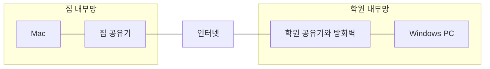
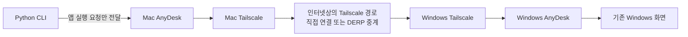
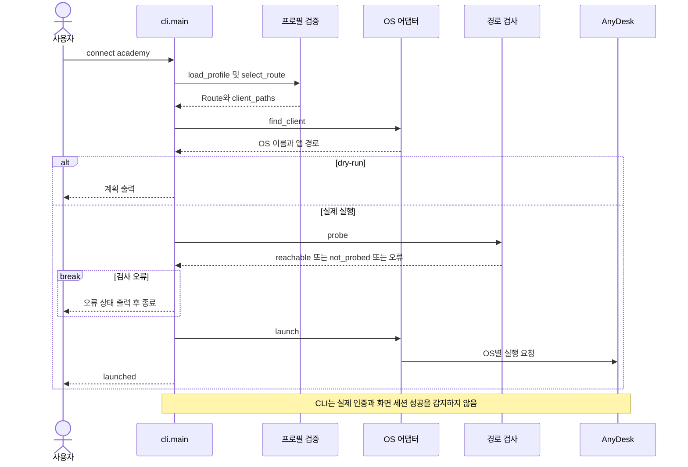
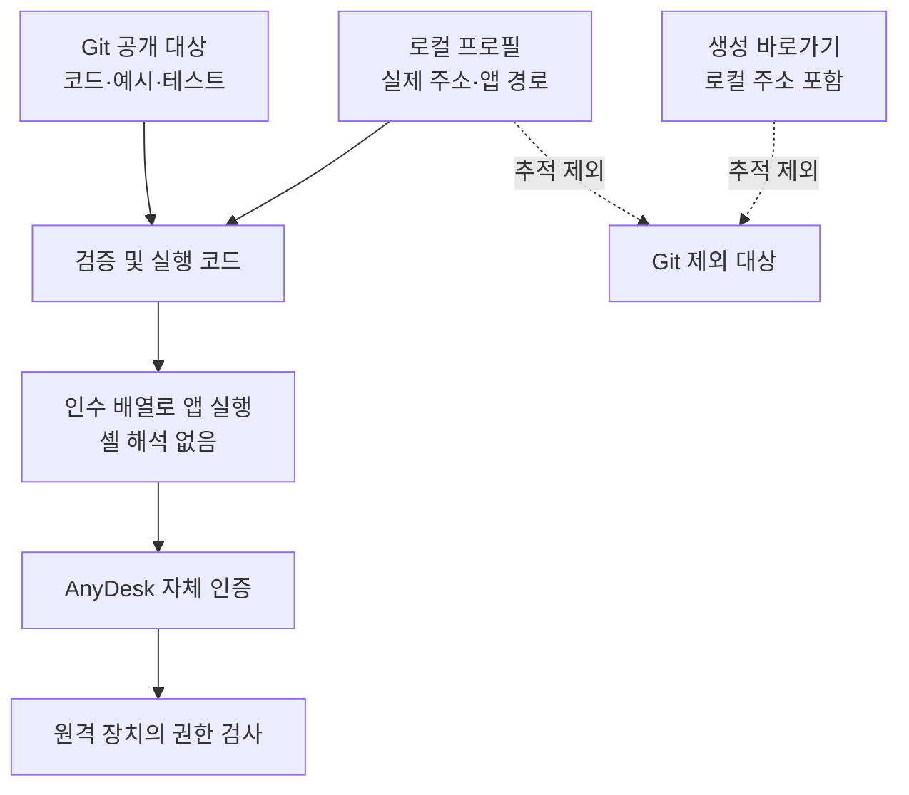

# 상세 구현 문서: 집에서 학원 PC까지 연결하기

이 문서는 v1.0.0과 v2.0.0의 실제 구현을 설명한다. 먼저 통신 경로를 설명하고, 그 위에서 Python 코드가 어떤 일을 하는지 따라간다. 실제 주소·계정·암호는 생략하며 모든 설정 예시는 설명용이다.

기준: `main`의 v1.0.0 (`3fb3a2f`), `feature/portable-access-v2`의 v2.0.0 (`5881a38`). 본 문서 작성으로 원격 PC나 애플리케이션 코드를 변경하지 않는다.

## 1. 전체 구조를 먼저 이해하기

현재 애플리케이션은 세 가지 역할 중 마지막 역할을 담당한다.

| 역할 | 담당 구성 요소 | 하는 일 |
| --- | --- | --- |
| 장치 간 통신 경로 | Tailscale 또는 AnyDesk 중계 경로 | 집과 학원 사이에서 앱 트래픽이 오갈 길 제공 |
| 원격 화면과 인증 | 양쪽 AnyDesk | 인증, 화면 전송, 입력 전달 |
| 접속 준비 자동화 | 우리가 만든 실행기와 CLI | 대상 선택, 설정 읽기, 사전 확인, 앱 실행 |

Python 프로세스가 화면 프레임을 받아 다시 전송하는 구조는 아니다. 새 중앙 서버나 원격 에이전트를 설치하지도 않는다. 접속 요청을 AnyDesk에 넘긴 뒤 CLI는 종료할 수 있고, 화면 세션은 AnyDesk가 유지한다.

### 집과 학원의 물리 네트워크



이 그림은 이해를 위한 일반적인 논리 구조다. 실제 공유기 대수, NAT 규칙, 학원 보안 장비 구성은 조사하지 않았다. 다른 장소의 내부 IP는 그 주소만 입력한다고 인터넷에서 바로 도달하는 것이 아니므로 접근 경로가 필요하다.

## 2. 세 가지 접속 방식에서 달라지는 것

### 2.1 일반적인 RDP

Mac의 RDP 클라이언트가 Windows의 RDP 서비스에 연결한다. 집과 학원이 다른 내부망이면 PC까지 도달할 VPN·게이트웨이·허용된 포트 전달 등의 경로가 별도로 필요하다. 그 뒤 Windows 계정 인증을 통과해야 한다.

이번 작업에서는 Tailscale 경로로 RDP 포트에 도달했지만 Windows 암호가 없어 로그인하지 못했다. 따라서 실패 원인은 이 단계에서는 인증이었다. RDP 설정은 이후에도 변경하지 않았다.

### 2.2 AnyDesk 단독

사용자가 AnyDesk ID를 입력하면 AnyDesk가 접속을 준비한다. 앱은 네트워크 상황과 옵션에 따라 직접 또는 중계 경로를 사용할 수 있다. 이번 비상 경로에서는 ID에 `/np`를 붙여 중계를 요청했고, 앱에서 중계 서버 연결을 확인했다.

Tailscale이 없는 경로도 준비할 수 있지만, 원격 AnyDesk의 승인 또는 무인 접속 인증은 여전히 필요하다. 중계 서버가 인증을 생략해 주는 것은 아니다.

### 2.3 현재 주 경로



AnyDesk가 대상의 Tailscale 주소에 연결한다. Tailscale의 가상 경로도 실제로는 앞서 설명한 집 공유기·인터넷·학원 공유기를 통과한다. 이 가상 경로를 사용한다는 것과 화면 제어 도구가 AnyDesk라는 것은 서로 다른 층의 선택이다.

현재 CLI는 `transport: tailscale` 설정을 보고 TCP 검사를 수행할 뿐, Tailscale 프로세스나 로그인 상태·실제 패킷 경유를 확인하거나 강제하지 않는다.

## 3. 최초 환경 설정과 평소 접속을 구분하기

최초에는 AnyDesk가 현장 승인을 기다려 접속하지 못했다. 기존 대상 장치용 SSH 키로 원격 관리자 인증에 성공한 뒤, 사용자의 명시적 승인을 받아 별도 AnyDesk 무인 접속 프로필을 생성했다. 이 프로필을 사용해 현장 조작 없이 GUI 세션에 들어갔다.

이것은 최초 준비 작업이었다. 평소 CLI 실행 때 다음 작업을 반복하지 않는다.

- SSH 키 탐색이나 관리자 로그인
- Windows 계정 암호 변경
- AnyDesk 무인 접속 권한 생성
- 방화벽·RDP·Tailscale 설정 변경

평소에는 사전에 준비된 AnyDesk 인증을 사용한다. 기존 SSH 관리 통로는 화면 데이터를 전달하는 필수 중간 단계가 아니다.

새 원격 PC를 추가할 때도 프로그램 설치와 허용된 인증 설정은 먼저 준비되어 있어야 한다. 프로필에 장치 이름을 추가하는 것만으로 원격 PC에 접근 권한이 생기지는 않는다.

## 4. v1: Mac 전용 실행기의 동작

코드: [academy.command](../../academy.command)

1. 실행 파일이 있는 폴더를 기준으로 `academy.anydeskid`를 찾는다.
2. Mac의 AnyDesk 설치 여부와 바로가기 파일 읽기 가능 여부를 확인한다.
3. `plutil`로 바로가기의 `id` 값을 읽는다.
4. 빈 주소·예시 주소·옵션처럼 시작하는 주소를 거부한다.
5. `nc`로 대상 TCP 7070에 연결할 수 있는지 확인한다.
6. `open -a AnyDesk`로 바로가기를 연다.

실제 IP는 커밋 전에 코드에서 제거했다. 커밋된 v1도 로컬 파일에서 주소를 읽는다. 다만 스크립트의 실행 방식은 zsh와 macOS 도구에 결합되어 있고, 다중 장치·다중 경로 선택 인터페이스가 없다.

설치된 Mac용 AnyDesk가 CLI 직접 주소 연결을 거부했기 때문에 `.anydeskid` 파일을 여는 방식으로 구현했다. 실제 앱의 제약에 맞춘 선택이다.

## 5. v2: 공통 CLI의 코드 구조

```text
remote.py                      CLI 시작
remote_access/
  cli.py                       명령 해석과 전체 호출 순서
  profiles.py                  설정 구조와 입력 검증
  connection.py                경로별 사전 점검
  platforms.py                 앱 탐색과 OS별 실행
examples/devices.json          가상 설정 예시
tests/test_remote_access.py   자동 테스트
```

OS 어댑터는 현재 `platforms.py` 한 파일 안의 분기다. 설계에서 언급했던 독립 제공자 플러그인, 별도 OS 패키지, 자격 증명 저장소는 구현하지 않았다.

### 데이터 모델

| 모델 | 주요 값 | 의미 |
| --- | --- | --- |
| `Profile` | devices, client_paths | 전체 장치 목록과 로컬 앱 위치 설정 |
| `Device` | label, routes | 한 대상 장치와 접속 경로 목록 |
| `Route` | name, provider, transport, endpoint, port | 한 번의 연결에 사용할 주소와 방식 |
| `AccessError` | status, message | 사용자가 이해할 수 있는 오류 구분 |

프로필의 authentication은 `application-managed`인지 검증하고, 파싱 후 인증 객체를 따로 보관하지 않는다. CLI에 암호 처리 기능을 넣지 않았기 때문이다. label은 설명용 데이터로 보관되지만 현재 `list` 출력은 별칭과 경로 이름만 보여준다.

## 6. 로컬 프로필 작성하기

예시 파일: [examples/devices.json](../../examples/devices.json)

```json
{
  "version": 1,
  "devices": {
    "academy": {
      "label": "Academy PC",
      "routes": [
        {
          "name": "primary",
          "provider": "anydesk",
          "transport": "tailscale",
          "endpoint": "pc.example.invalid"
        },
        {
          "name": "fallback",
          "provider": "anydesk",
          "transport": "vendor-relay",
          "endpoint": "123456789"
        }
      ],
      "authentication": {"mode": "application-managed"}
    }
  }
}
```

주소는 모두 설명용이다. 실제 사용 전에 본인 대상의 값으로 바꿔야 하며 예시 ID에 접속하지 않는다.

- `version: 1`은 설정 형식 버전이다. 프로젝트 버전 `2.0.0`과 다르다.
- `academy`는 사용자가 명령에서 고르는 별칭이다.
- 경로를 지정하지 않으면 `routes`의 첫 번째 항목을 사용한다. 반드시 primary라는 이름이어야 하는 것은 아니다.
- endpoint에는 `/np`를 직접 넣지 않는다. 중계 경로일 때 실행 어댑터가 붙인다.
- `provider`는 현재 anydesk만 지원한다.
- `port`는 주 경로에서 생략하거나 7070으로 지정한다. 비상 경로에는 port 필드를 넣지 않는다.
- 필요하면 최상위 client_paths에 Darwin·Windows·Linux별 앱 위치를 둔다. 자동 탐색 대신 해당 경로만 검사하므로 잘못 지정하면 자동 후보로 되돌아가지 않는다.

검증기는 필수 필드, 지원하지 않는 필드, 별칭 형식, 중복 경로 이름, 제공자, 전송 방식 등을 검사한다. 주소에는 옵션·공백·URL·포트·경로 문자가 들어가지 못하게 제한한다. 이 검사는 주소 문자열 형식 검사이지 실제 DNS·IPv4 유효성이나 대상 소유권을 보증하는 검사가 아니다. IPv6와 AnyDesk의 모든 별칭 형식을 지원하는 것도 아니다.

기본 설정 파일은 실행 프로젝트 루트의 `devices.local.json`이다. 현재 터미널의 작업 폴더가 아닌 코드 위치를 기준으로 찾는다. `--config`를 주면 다른 파일을 사용할 수 있다.

## 7. 명령별 실제 호출 순서

### list

`load_profile()` → 전체 설정 검증 → 별칭과 경로 이름 출력.

앱 탐색, 네트워크 검사, 파일 생성, 앱 실행을 하지 않는다. 일부 장치에 사용하지 않는 잘못된 설정이 있어도 전체 프로필 검증 단계에서 실패할 수 있다.

### connect --dry-run

`load_profile()` → `select_route()` → `find_client()` → 계획 출력.

네트워크 검사와 앱 실행은 하지 않지만 AnyDesk 설치 위치는 확인한다. 따라서 앱이 없는 장치에서는 dry-run도 client_missing으로 실패할 수 있다. 실제 endpoint와 명령 인수 전체는 출력하지 않는다.

### doctor

`load_profile()` → `select_route()` → `find_client()` → `probe()` → 결과 출력.

주 경로는 TCP 점검 결과를, 비상 경로는 점검 생략 상태를 출력한다. 이름과 달리 Tailscale·방화벽·인증 상태를 모두 진단하는 도구는 아니다.

### connect

`load_profile()` → `select_route()` → `find_client()` → `probe()` → `launch()` → launched 출력.

실패 시 자동으로 다른 경로를 고르지 않는다. 사용자가 `--route fallback`을 명시해야 한다. launched 이후의 인증 창과 화면 연결은 AnyDesk에서 확인한다.



## 8. 경로 검사는 왜 별도 프로세스인가

코드: [connection.py](../../remote_access/connection.py)

주 경로에서는 `socket.create_connection()`에 3초 제한을 준다. 이 함수가 사용하는 DNS 이름 해석까지 전체 3초로 제한된다고 가정하지 않고, 작은 Python 자식 프로세스에서 검사를 수행한 뒤 부모가 5초 제한을 적용한다.

자식 실행 인수는 현재 Python 실행 파일, `-S`, 검사 코드, endpoint, port다. 셸 문자열로 endpoint를 실행 코드에 끼워 넣지 않는다. 검사 프로세스의 출력과 오류는 버려 실제 주소 등이 그대로 출력되지 않게 한다.

연결 성공은 reachable이며, 실행 오류·TCP 실패·시간 초과는 unreachable로 묶는다. 이것만으로 PC 전원 문제인지 방화벽인지 Tailscale 문제인지 구별할 수는 없다.

중계 경로는 자식 프로세스를 만들지 않고 not_probed를 반환한다. 주 경로 TCP 검사에 비상 경로를 종속시키지 않기 위한 구현이다. AnyDesk 중계 서비스가 실제 정상인지 확인하는 검사는 별도로 구현하지 않았다.

## 9. OS 어댑터가 하는 일

코드: [platforms.py](../../remote_access/platforms.py)

### 앱 탐색

| OS | 기본 탐색 방법 |
| --- | --- |
| macOS / Darwin | 시스템 Applications, 사용자 Applications의 AnyDesk.app |
| Windows | PATH의 AnyDesk.exe, ProgramFiles·ProgramFiles(x86)·LOCALAPPDATA 아래의 후보 |
| Linux | PATH의 anydesk |

후보는 절대 경로여야 한다. Mac은 앱 폴더와 내부 실행 파일의 존재를 확인한다. Linux는 실행 권한도 확인한다. 앱 버전·서명·CLI 기능을 자동으로 협상하는 기능은 없으므로, '앱을 찾았다'와 '해당 버전에서 실행 방식이 지원된다'도 구분한다.

### macOS 실행

설정 파일이 있는 폴더의 `.local/`에 새로운 `.anydeskid` 파일을 만든다. 디렉터리 권한은 0700, 파일은 mkstemp의 0600을 사용한다. 마지막 경로인 `.local` 자체가 심볼릭 링크이면 거부한다. 모든 상위 경로와 경쟁 조건까지 검증하는 보안 장치라고 보장하지는 않는다.

파일에는 `id`와 `type: deskrt`만 기록한다. 주 경로 id는 endpoint 그대로, 비상 경로는 endpoint 뒤에 `/np`를 붙인다. 이어 `/usr/bin/open -a 앱경로 바로가기경로`를 인수 배열로 실행하며 10초 제한을 둔다.

생성 파일은 실행 후 자동 삭제하지 않으므로 누적될 수 있다. 암호는 없지만 주소는 포함되므로 Git에서 제외하고 로컬 정보로 취급한다.

### Windows/Linux 실행

`subprocess.Popen([앱경로, 접속주소])`로 실행한다. 표준 입력과 출력을 연결하지 않고 자식 프로세스의 종료를 기다리지 않는다. 따라서 실행 직후 앱이 옵션을 거부하거나 내부 오류가 발생해도 CLI가 감지하지 못할 수 있다. 현재 해당 두 OS에서는 인수 생성 모의 테스트만 수행했다.

## 10. 반환 상태와 종료 코드

| 결과 | 의미 | 종료 코드 |
| --- | --- | --- |
| list / dry_run | 목록 또는 실행 준비 정보 출력 | 0 |
| reachable | TCP 연결 성공 | 0 |
| not_probed | 비상 경로 사전 TCP 검사 생략 | 0 |
| launched | 클라이언트 실행 요청 전달 | 0 |
| invalid_config | 설정 읽기·형식·지원 범위 오류 | 1 |
| unknown_device / unknown_route | 별칭 또는 경로 없음 | 1 |
| unsupported_platform / client_missing | OS 미지원 또는 앱을 찾지 못함 | 1 |
| unreachable / launch_failed | 검사 또는 실행 요청 실패 | 1 |

위 표는 처리된 애플리케이션 상태다. argparse의 잘못된 명령 인수는 통상 2, 도움말은 0으로 종료한다. 모든 예상 밖 Python 예외를 AccessError로 변환하는 것은 아니다. 또한 현재 애플리케이션 오류 메시지는 표준 출력에 출력한다.

## 11. 보안 책임과 로컬 파일



- CLI는 application-managed 인증만 허용하고 암호 필드를 저장하지 않는다.
- 로컬 파일 접근 권한과 `.gitignore`는 서로 다른 통제다. Git 제외는 암호화가 아니다.
- 기존 평문 접속 정보 파일과 SSH 키는 새 CLI가 사용하지 않는다.
- 입력 검증과 셸 없는 실행은 인수 해석 위험을 줄이지만 앱 경로의 신뢰성까지 보증하지 않는다.
- 네트워크 암호화와 원격 인증은 기존 제품의 책임이며 이 도구가 직접 구현하지 않는다.
- 실제 경로가 Tailscale을 통과하는지 검증하지 않으므로 이 설정명만으로 네트워크 접근 통제를 주장하지 않는다.

## 12. 로컬에서 사용하기

현재 프로젝트는 Python 3.9 이상과 AnyDesk를 요구한다. 외부 Python 패키지는 필요하지 않다. 이 Mac에서 site 초기화 오류를 피하기 위해 아래처럼 `-S`를 사용한다.

```sh
# 프로젝트 폴더에서 기존 설정을 덮어쓰지 않고 예시 복사
cp -n examples/devices.json devices.local.json
chmod 600 devices.local.json
```

Windows PowerShell에서는 다음처럼 복사한다.

```powershell
if (-not (Test-Path devices.local.json)) {
    Copy-Item examples/devices.json devices.local.json
}
```

Windows에 Python 런처가 설치되어 있으면 아래 명령의 `python3 -S` 대신 `py -3 -S`를 사용한다.

이후 파일의 예시 값을 실제로 허용된 대상 정보로 바꾼다. 실제 접속 전에 원격 앱과 무인 접속 인증이 준비되어 있는지 확인한다.

```sh
python3 -S remote.py list
python3 -S remote.py connect academy --dry-run
python3 -S remote.py doctor academy
python3 -S remote.py connect academy
python3 -S remote.py connect academy --route fallback
```

다른 프로필을 쓰려면 전역 옵션을 하위 명령 앞에 둔다.

```sh
python3 -S remote.py --config /path/to/devices.local.json list
```

Mac GUI 사용자는 기존 `academy.command`도 계속 사용할 수 있다. 이것은 v2 CLI를 호출하는 래퍼가 아니라 이전 독립 실행기다. 두 설정 파일을 각각 바꾸면 대상이 달라질 수 있으므로 사용할 진입점을 구분한다.

## 13. 검증 범위와 문제 확인 순서

현재 테스트 14개는 설정 검증, 주소 인수 제한, 포트 제한, 시간 초과, 중계 검사 생략, OS별 실행 인수, 생성 plist와 권한, dry-run 부작용 방지 등을 확인한다.

```sh
python3 -S -m unittest discover -s tests -v
```

Mac에서는 실제 주 경로 TCP 진단과 비상 경로 실행을 확인했다. 이미 인증된 AnyDesk 세션을 연 것이므로 신규 인증과 재부팅 복구까지 검증했다고 해석하지 않는다. Windows/Linux 실제 GUI 접속, Tailscale 중단 상태, 원격 PC 재부팅 복구, 통제된 성능 비교는 남아 있다.

문제가 생기면 다음 순서로 좁힌다.

1. invalid_config이면 JSON 문법과 지원 필드·주소 형식부터 확인한다.
2. client_missing이면 앱 설치와 client_paths 설정을 확인한다.
3. unreachable이면 선택한 주소·PC 전원·네트워크·방화벽을 확인한다. 이 도구가 원인을 자동 분류하지는 않는다.
4. 주 경로가 막혔다면 필요 시 명시적으로 fallback을 선택한다.
5. launched인데 화면이 없으면 AnyDesk의 인증 요청과 오류를 확인한다.
6. 비상 경로도 실패하면 인터넷·원격 앱·원격 OS 등 공통 장애 원인을 살핀다.

단일 ping 관측값은 GUI 성능 측정이 아니다. 과거 관측한 중계와 직접 연결의 지연 차이를 v2 코드 개선 효과로 계산하지 않는다.

## 참고 자료

- [통합 포트폴리오 사례](CASE_STUDY.md)
- [개념과 표현 해설](CONCEPTS.md)
- [현재 README](../../README.md)
- [설정 검증 코드](../../remote_access/profiles.py)
- [CLI 코드](../../remote_access/cli.py)
- [테스트 코드](../../tests/test_remote_access.py)

본문 다이어그램은 실제 코드를 설명하는 논리 모델이며, 학원 네트워크 실사나 패킷 캡처 결과는 아니다.
