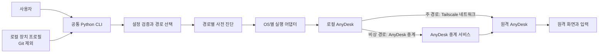
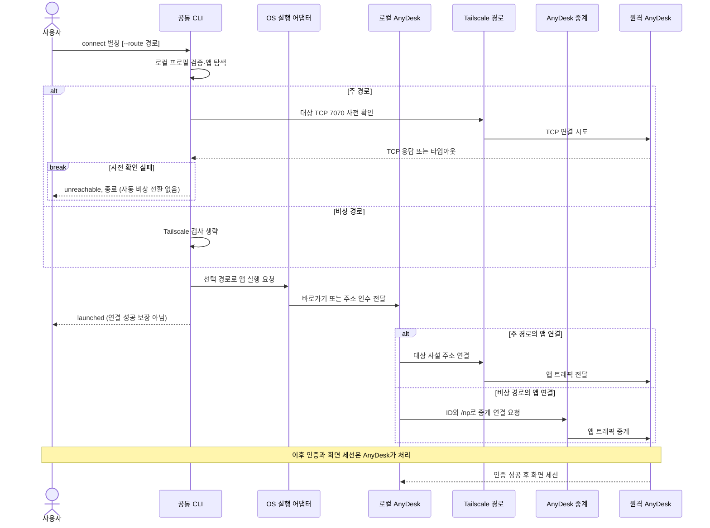
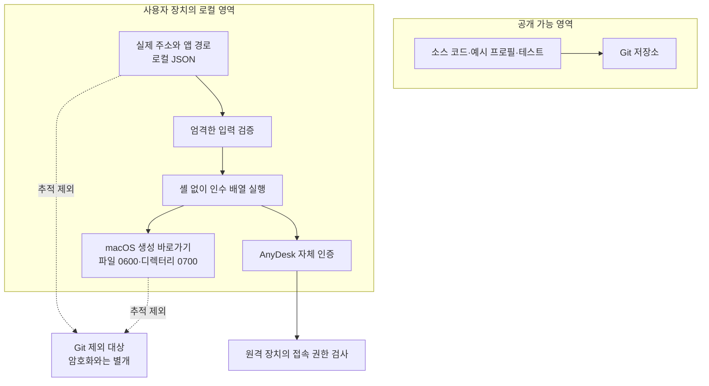

# 포트폴리오 제작 기획서

- 문서 상태: 기획 초안
- 작성일: 2026-09-05
- 기준 구현: v2.0.0 (`5881a38`), 기존 실행기 기준: v1.0.0 (`3fb3a2f`)
- 대상 독자: 주니어 개발자·인프라·DevOps 채용 담당자 및 기술 면접관
- 이번 산출물: 포트폴리오의 이야기 구성, 근거 목록, 비교 기준, 다이어그램 초안, 제작 순서
- 범위 밖: 원격 PC 설정 변경, 신규 기능 구현, 외부 게시, 배포, 추가 커밋

## 1. 제목과 핵심 메시지

**가제: 현장 승인 없이 시작한 원격 접속 — 장치 프로필 기반 연결 CLI로 발전시키기**

한 줄 소개: 집에서 접근할 수 없는 원격 PC의 인증·네트워크 문제를 기존 관리 연결로 해결하고, 특정 Mac에 묶였던 실행 절차를 장치 프로필과 OS별 어댑터로 분리한 Python 애플리케이션.

강조할 역량은 네트워크와 인증을 구분한 진단, 제약에 따른 대안 선택, 복구 경로 분리, 작은 애플리케이션으로 반복 작업을 일반화한 설계다. 자체 VPN·원격 화면 프로토콜·암호화 엔진을 개발한 프로젝트로 소개하지 않는다.

## 2. 개발 계기와 문제 정의

### 사용자 상황

사용자는 집에 있고, 원격 PC는 학원에 있다. 목표는 명령 실행을 넘어 기존 Windows 화면을 보고 마우스와 키보드로 작업하는 것이었다. 현장에 있는 사람이 승인 버튼을 눌러줄 수 없었다.

### 처음 막힌 지점

- Tailscale 네트워크 연결이 되어도 GUI 인증이 자동 해결되지는 않았다.
- RDP 포트에 도달했지만 Windows 로그인 암호를 몰랐다.
- AnyDesk는 양쪽에 설치되어 있었으나 처음에는 원격 승인 대기 상태였다.
- 접속에 성공한 이후에도 실행 스크립트가 Mac 앱 경로와 특정 주소에 결합되어 있었다.
- 주 연결과 SSH 관리 연결이 모두 Tailscale에 의존하므로 같은 장애에 영향을 받을 수 있었다.

핵심 문제를 두 단계로 나눈다.

1. **접근 가능성:** 물리적 방문 없이, 보유한 정당한 인증 수단으로 GUI 접속을 확보한다.
2. **반복 사용성:** 장치나 클라이언트 OS가 바뀌어도 대상별 코드 수정 없이 연결을 준비한다.

## 3. 해결 접근과 의사결정 과정

| 단계 | 질문 | 확인·행동 | 다음 결정의 근거 |
| --- | --- | --- | --- |
| 네트워크 | 원격 장치에 도달하는가? | Tailscale ping 및 필요한 TCP 포트 확인 | 연결 통로와 앱 인증을 구분 |
| 인증 | 현장 승인 없이 사용할 인증이 있는가? | 기존 장치용 SSH 키로 관리자 인증 성공 | Windows 암호 변경 없이 관리 명령 사용 가능 |
| 최초 복구 | GUI 인증을 원격에서 설정할 수 있는가? | 사용자 명시적 승인 후 별도 AnyDesk 무인 접속 프로필 생성 | 기존 관리자 암호 유지, 화면 입력 권한 부여 |
| 실행 간소화 | Mac에서 반복 실행할 수 있는가? | 설치된 AnyDesk의 CLI 제약 확인 후 자체 바로가기 사용 | 작동하는 앱 실행 방식에 맞춰 v1 제작 |
| 경로 분리 | 주 경로에 문제가 있으면 어떻게 하는가? | AnyDesk ID + /np로 중계 경로 접속 확인 | Tailscale IP 검사와 독립된 비상 경로 구성 |
| 일반화 | 특정 장치와 OS 정보를 어디에 둘 것인가? | v2에서 로컬 JSON 프로필과 OS 어댑터 분리 | 공통 CLI, 장치 추가 시 코드 수정 최소화 |

최초 SSH 설정 작업은 운영·복구 과정이다. v2 CLI가 자동으로 SSH 키를 찾아 관리자 권한을 얻거나 원격 보안 설정을 바꾸는 것은 아니다.

## 4. 대안 비교와 선택 이유

평가 기준: 현장 조작 필요성, 현재 보유 인증으로 실행 가능성, 기존 화면 연속성, 운영 의존성, 다중 OS 적용 비용.

| 대안 | 장점 | 이번 상황의 제약 | 결정 |
| --- | --- | --- | --- |
| Tailscale + RDP | Windows 내장 서비스 활용, 별도 화면 서버 의존성 감소 가능 | Windows 인증 미확보; 계정 선택에 따라 기존 작업 환경과 달라짐; 성능 우위 미측정 | 설정 유지, 이번 구현에서 전환하지 않음 |
| AnyDesk 승인 방식 | 이미 설치된 도구로 화면 공유 가능 | 승인할 사람이 현장에 없음 | 최초 문제를 해결하지 못함 |
| 기존 SSH 관리 연결 + AnyDesk 무인 접속 | 보유 키로 관리 인증 가능, 기존 화면 사용 가능 | 지속적인 접속 권한 생성에 사용자 승인 필요; AnyDesk 의존성 | 최초 복구에 채택 |
| Tailscale + AnyDesk 직접 주소 | 이미 검증된 경로, 사설 주소로 대상 지정 | Tailscale 경로 장애에 영향 | 주 경로로 유지 |
| AnyDesk ID 중계 | Tailscale IP를 지정하지 않는 다른 연결 경로 | 공급자 중계 서비스·인터넷 의존, 전체 장애 독립성 미검증 | 명시적 비상 경로로 채택 |
| 공인망 SSH/RDP 노출 | 사설망 접속 도구 없이 직접 접속하는 구성 가능 | 학원 NAT·방화벽·운영 정책 검토 필요, 노출 범위 증가 | 이번 범위에서 채택하지 않음 |
| 중앙 웹 게이트웨이 | 브라우저 중심 사용 경험을 설계할 수 있음 | 서버·인증·중계 운영이 추가됨; 현재 규모에 비해 부담 | 향후 요구가 생길 때 재검토 |

v2는 화면 전송 계층을 추가하는 대신 연결 준비 계층을 추가했다. 별도 상시 중계 서버를 운영하지 않지만, 클라이언트 앱과 Python 런타임의 의존성은 남는다.

## 5. 구현 설명 구성

### 직접 만든 범위

| 파일 | 설명할 책임 |
| --- | --- |
| `remote.py` | 공통 CLI 진입점 |
| `remote_access/cli.py` | list/connect/doctor, 명시적 경로 선택, 결과 출력 |
| `remote_access/profiles.py` | JSON 구조·경로·주소 입력 검증, 인증 정보 필드 제한 |
| `remote_access/connection.py` | TCP 사전 확인, DNS를 포함한 검사 시간 제한, 중계 경로 검사 분리 |
| `remote_access/platforms.py` | 앱 탐색, OS별 실행 인수 및 macOS 바로가기 생성 |
| `tests/test_remote_access.py` | 오류 처리·경로 분리·OS 명령 생성 테스트 |

### 설계 결정으로 설명할 내용

- JSON: 추가 파서 라이브러리 없이 Python 표준 라이브러리로 처리.
- 프로필: 대상 주소와 앱 경로를 코드에서 분리. 현재 지원 제공자는 AnyDesk 하나.
- 어댑터: 현재 하나의 `platforms.py`에서 OS별 분기를 담당. 플러그인 시스템이나 OS별 독립 패키지까지 구현한 것은 아님.
- 인증: application-managed만 지원. 새 CLI는 기존 평문 암호 파일을 읽거나 암호를 전달하지 않음.
- 안전한 실행: 셸 문자열 대신 인수 배열 사용, 옵션처럼 해석될 주소·URL·공백 등 거부.
- 상태 표현: `reachable`은 TCP 도달, `launched`는 앱 실행 요청. 인증·GUI 연결 성공과 구분.
- 복구: 자동 재시도·자동 경로 전환 대신 사용자가 비상 경로를 명시.
- 초기 범위 제한: TCP 7070만 지원, IPv6·사용자 지정 포트·환경변수 치환 미지원.

### 데모 명령

실제 접속 정보가 없는 예시 프로필과 모의 환경으로 설명용 화면을 제작한다. 설치 앱이 없으면 dry-run도 앱 탐색 단계에서 실패할 수 있음을 안내한다.

```sh
python3 -S remote.py list
python3 -S remote.py connect academy --dry-run
python3 -S remote.py doctor academy
python3 -S remote.py connect academy --route fallback
```

## 6. 시각 자료 기획과 Mermaid 초안

시각 자료는 장식보다 책임·시간 순서·신뢰 경계를 설명하는 데 사용한다. 아래 Mermaid를 원본으로 유지하고, 최종 포트폴리오 작성 단계에서 SVG로 내보낸다. 현재 별도 이미지 파일은 제작하지 않았다.

### A. 전체 아키텍처 — 연결 준비와 실제 화면 전송 분리



캡션: Python은 연결을 준비하고 앱을 실행한다. 화면 데이터와 인증은 기존 접속 도구가 담당한다. Tailscale 경로는 상황에 따라 직접 연결 또는 DERP 중계를 사용할 수 있다.

### B. 네트워크 시퀀스 — 앱 실행 이후의 책임 구분



표현 수준: 제품 내부 핸드셰이크의 패킷 단위 재현이 아니라 실제 확인한 책임과 연결 순서를 보여주는 논리 시퀀스다.

### C. 보안 구조 — 인증 정보와 공개 코드의 경계



점선은 파일 전송이 아니라 Git 추적 제외 관계를 나타낸다. 최종 이미지에서도 선 종류와 범례를 유지한다. 인증 암호가 Python CLI를 통과하는 화살표는 그리지 않는다.

### D. 추가 이미지 구성

| 그림 | 전달할 내용 | 제작 방식 |
| --- | --- | --- |
| v1 → v2 비교 | 단일 Mac 스크립트에서 프로필·어댑터 분리로 발전 | Mermaid 또는 SVG |
| 장애 지도 | Tailscale 경로 장애와 전원·인터넷 공통 장애 구분 | 두 경로와 공통 노드 강조 |
| 상태 카드 | dry_run / reachable / launched 의미 구분 | CLI 출력 기반 정적 카드 |
| 검증 표 | 실제 Mac 확인과 Windows/Linux 모의 검증 구분 | 표 또는 SVG |

모든 그림은 가상 별칭만 사용한다. 실제 IP·AnyDesk ID·계정·SSH 키 이름·암호·개인 바탕화면은 노출하지 않는다. 실제 기술 구조를 보여주는 그림에는 생성형 이미지보다 수정 가능한 벡터 다이어그램을 우선한다.

## 7. 보안 설명의 근거와 한계

| 위험 | 이번에 적용한 대응 | 남는 한계 |
| --- | --- | --- |
| 주소·암호의 Git 유입 | 로컬 파일 분리, .gitignore, 커밋 전 실제 값 포함 여부 검사 | .gitignore는 암호화·유출 방지 시스템이 아님 |
| 실행 인수 악용 | 주소 형식 제한, shell=True 미사용 | 로컬 앱 경로 설정은 신뢰하는 사용자 입력; 앱 진위 검증은 없음 |
| 진단 무한 대기 | TCP 3초, 외부 프로세스 5초 제한 | TCP 성공만으로 앱 상태·인증을 판단할 수 없음 |
| 인증 정보 확산 | CLI가 암호·SSH 키를 취급하지 않음 | 최초 운영 과정에서 만든 평문 암호 파일은 로컬에 남아 있음 |
| 경로 장애 | 주·비상 경로 명시적 분리 | Tailscale 실제 중단·재부팅 복구는 미검증 |
| 과도한 권한 변경 | 최초 설정 때 명시적 승인, 별도 AnyDesk 프로필 사용 | 원격 Windows 세션 자체는 관리자 계정이었음; 완전한 최소 권한 운영이라고 주장하지 않음 |

`transport: tailscale`은 프로필의 경로 분류다. 현재 CLI는 설정 주소로 TCP 접속을 시험할 뿐 Tailscale 설치·로그인·실제 경유를 검증하거나 강제하지 않는다. 따라서 CLI 자체가 Tailscale 보안 경계를 보장한다고 표현하지 않는다.

암호화 구현은 Tailscale·AnyDesk의 책임이다. 프로젝트의 기여는 설정·실행·공개 범위의 경계 관리이며, 자체 암호화 구현이나 보안 인증 획득으로 표현하지 않는다.

## 8. 성과와 증거 수집 계획

| 주장 | 현재 근거 | 포트폴리오 표현 |
| --- | --- | --- |
| 집에서 GUI 접속 문제 해결 | AnyDesk 세션 화면 확인 및 사용자 성공 확인 | 실제 문제 해결 사례 |
| 주 경로 상태 확인 | 초기 DERP 약 74~78ms, 이후 직접 연결 약 21ms | 서로 다른 시점의 관측값; 통제된 성능 실험 아님 |
| 복구 경로 분리 | AnyDesk ID + /np 접속, Relay-Server 표시 | 중계 경로 접속 확인; 완전한 장애 복구 검증은 아님 |
| 코드 검증 | 14개 unittest 통과, 독립 리뷰 | 테스트 결과와 검토 중 포트 불일치 수정 소개 |
| 다중 OS 설계 | Mac 실제 진단·실행, Windows/Linux 명령 생성 모의 테스트 | 다중 OS 어댑터 구현; 모든 OS 실접속 검증 아님 |
| 버전 구분 | main/v1.0.0, feature/portable-access-v2/v2.0.0 | 기존 실행기 보존과 새 구현 분리 |

성능 수치를 막대그래프로 사용할 경우 '서로 다른 시점의 경로 관측'을 제목에 명시한다. '앱 개발로 지연 70% 개선', 'RDP보다 빠름', '무중단 보장' 등의 주장은 하지 않는다.

추가로 확보할 자료: 비밀 값 없는 테스트 출력, 가상 프로필의 CLI 데모, 코드 링크, Windows/Linux 실제 실행 결과. 추가 실험은 별도 작업으로 계획하며 완료된 것처럼 쓰지 않는다.

## 9. 최종 포트폴리오 구성안

첫 화면은 문제와 해결 결과를 30초 안에 이해할 수 있게 만든다. 본문은 약 6~8페이지 PDF 또는 같은 분량의 Markdown 사례 문서로 구성한다.

1. 한 장 요약: 사용자 상황·제약·핵심 결정·현재 결과.
2. 문제 분석: 네트워크 연결과 인증을 분리한 진단.
3. 대안 비교: RDP·승인형 AnyDesk·무인 접속·공통 실행 계층의 선택 근거.
4. 해결 과정: 최초 관리 접속부터 v1·v2까지의 결정 흐름.
5. 구현: 프로필·검증·경로·OS 어댑터와 코드 근거.
6. 네트워크 시퀀스 및 보안 경계.
7. 검증·실패 사례·개선 과정.
8. 한계·회고·다음 실험.

기여 표기: AI 코딩 도구와 협업한 프로젝트임을 밝힌다. 사용자 담당 범위는 실제 수행 내용에 맞춰 문제 정의·요구사항·설계 선택·접속 권한 승인·사용 결과 검증으로 정리한다. 코드·테스트·문서 작성의 AI 지원을 숨기거나 혼자 모두 작성한 것으로 표현하지 않는다.

## 10. 제작 순서와 완료 기준

### 다음 제작 순서

- [ ] 이 기획서 기준으로 채용 포지션에 맞는 핵심 메시지를 선택한다. 기본은 소프트웨어 개발 + 인프라 문제 해결 사례다.
- [ ] `CASE_STUDY.md`에 최종 서술 초안을 작성한다.
- [ ] `diagrams/`에 네트워크·보안·아키텍처 Mermaid 원본을 분리한다.
- [ ] 도식의 성공·실패 분기와 제외 경계를 검토한 뒤 SVG로 렌더링한다.
- [ ] 가상 설정으로 CLI 데모 이미지와 테스트 결과를 준비한다.
- [ ] 근거·개인정보·기여 범위를 독립 검토한다.
- [ ] 필요 시 PDF로 편집하고 사용자 검토 후 공개 여부를 결정한다.

### 기획서 완료 기준

- [x] 개발 계기, 접근 과정, 대안 비교, 구현 설명의 구성이 있다.
- [x] 네트워크·보안·전체 아키텍처 다이어그램 초안이 있다.
- [x] 구현 완료·관측 결과·미검증·후속 계획을 구분한다.
- [x] 실제 접속 정보 없이 공개 가능한 내용으로 작성한다.
- [x] 독립 검토에서 사실 관계와 공개 범위를 확인한다. 네트워크 실패 분기, Git 제외 표현, Tailscale 경유 검증 한계를 보완했다.

최종 포트폴리오 제작은 이번 기획서 이후 단계다. 현재 문서를 최종 PDF·이미지 제작 완료로 간주하지 않는다.

## 11. 근거 파일

- ../../README.md — 현재 기능·사용법·한계
- ../../ARCHITECTURE.md — 당시 네트워크·계정 진단 기록
- ../../CHANGELOG.md — 버전 구분
- ../../remote_access/ — 실제 구현
- ../../tests/test_remote_access.py — 자동 테스트

기획서에서 외부 기술 일반론을 최종 서술로 확장할 때는 해당 시점의 Tailscale·AnyDesk·Microsoft 공식 문서를 다시 확인하여 출처를 붙인다. 현재 관측 결과는 이 프로젝트에서 수행한 작업 기록에 근거한다.
